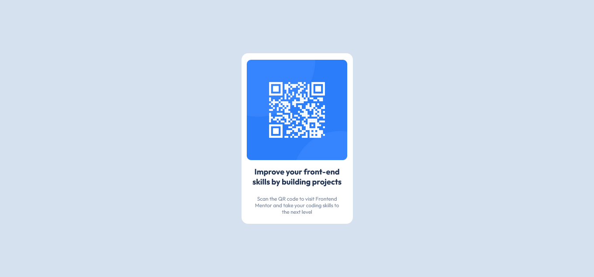

# Frontend Mentor - QR code component solution

This is a solution to the [QR code component challenge on Frontend Mentor](https://www.frontendmentor.io/challenges/qr-code-component-iux_sIO_H). Frontend Mentor challenges help you improve your coding skills by building realistic projects. 

## Table of contents

- [Overview](#overview)
  - [Screenshot](#screenshot)
  - [Links](#links)
- [My process](#my-process)
  - [Built with](#built-with)
  - [Continued development](#continued-development)
- [Author](#author)
- [Acknowledgments](#acknowledgments)

## Overview

### Screenshot

### Links

- Solution URL: [GitHub](https://github.com/mahmoudamr512/Frontend-Mentor-Challenges/tree/main/QR%20Code%20Challenge)
- Live Site URL: [QRChallengeLive](https://qrc-hallenge-vercel.vercel.app/)

## My process

### Built with

- Semantic HTML5 markup (Used Figure for image and Figcaption)
- CSS custom properties
- Flexbox
- Mobile-first workflow

### Continued development

I would love to focus more on using CSS grids instead of flexbox to extend my toolbox. 

## Author

- Frontend Mentor - [@mahmoudamr512](https://www.frontendmentor.io/profile/mahmoudamr512)
- Twitter - [@mahmoudamr512](https://twitter.com/mahmoudamr512)

## Acknowledgments

To the youtuber who let me know this awesome website "Frontend Mentor", one of the greatest youtubers: [Kevin Powell](https://www.youtube.com/kepowob)

